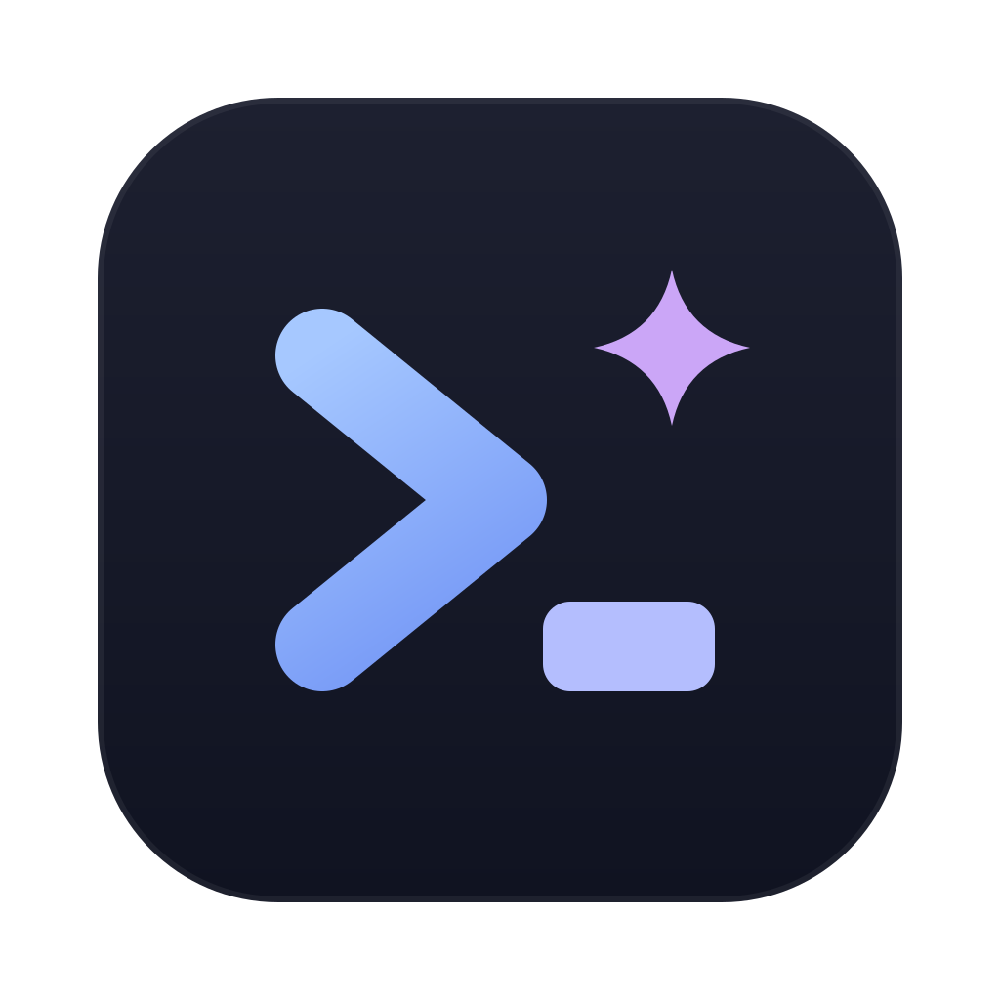
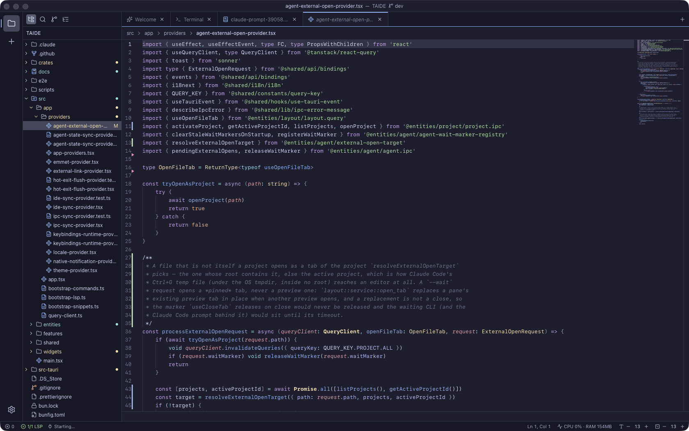

<div align="center">



# TAIDE

**An agent-native IDE for macOS — Rust core, Monaco editor, real terminal, Git, and Claude Code wired in.**

[Download](https://github.com/B-HS/TAIDE/releases/latest) · [Claude Code](#claude-code) · [Shortcuts](#keyboard-shortcuts) · [Development](#development)

</div>



TAIDE is a personal IDE built for the terminal-agent era. Every piece of state — projects, tabs, splits, terminals, Git, language servers — is owned by a Rust core, and the React view only renders it: reload the window, or quit and relaunch, and everything comes back exactly as you left it. It is not Electron, it does not run VS Code extensions, and it stays light enough to leave open for days.

## Features

- **Multi-project workspace** — open several folders side by side and switch instantly; tabs, splits, terminals and the active file are restored after a restart
- **Editor** — Monaco with VS Code keybindings, language servers for 18 languages (TypeScript/JavaScript, Rust, Python, Go, Java, C/C++, Kotlin, Swift, Dart, Ruby, Scala, Haskell, Elixir, Lua, Zig, TOML, Terraform, Markdown) installed on demand, inline blame, git gutter, format and code actions on save, `.editorconfig`, snippets, Emmet
- **Terminal** — your login shell in a real pty (xterm + WebGL), command blocks, clickable file links, split terminals, sessions that survive tab switches and window reloads
- **Git** — VS Code-style source control: staged/unstaged changes, side-by-side diffs, hunk and line staging, commit, push/pull, branches, stashes, commit graph, conflict resolution
- **Claude Code** — agents running in the terminal are detected and badged when they need your input, Ctrl+G edits round-trip into a TAIDE tab, an IDE MCP server lets Claude open files, show diffs and read your selection, and macOS notifications tell you when it finishes
- **AI** — inline completions, inline edit and commit-message generation through Ollama Cloud, Codex or a local OpenAI-compatible server
- **Preview** — images, video, audio, PDF, HTML, spreadsheets, HWP/HWPX documents, Markdown
- **Themes** — 36 bundled VS Code-derived themes plus `.vsix` theme import; UI, editor tokens and terminal ANSI colors come from one palette
- **Remote control** — mirror the workspace in a browser on another device over the built-in, password-protected server
- **And more** — task runner (npm, Cargo, Make), command palette, quick open, workspace symbols, Zen mode, fully remappable keybindings
- **Localized** — English · 한국어 · 日本語

## Install

Download the latest DMG from [Releases](https://github.com/B-HS/TAIDE/releases/latest) and drag **TAIDE** into Applications.

- macOS on Apple Silicon
- Signed and notarized
- Optional: run **Shell Command: Install 'taide' command in PATH** from the command palette to get the `taide` CLI (`taide <file>` opens a file, `taide --wait <file>` works as `$EDITOR`)

## Claude Code

Run `claude` inside a TAIDE terminal and TAIDE sets `EDITOR`/`VISUAL` for that shell, so **Ctrl+G** opens the prompt in a TAIDE tab — save and close the tab to hand the text back. From any other terminal, `export EDITOR="taide --wait"` does the same. Turn on **IDE integration** in Settings to let Claude Code open files, show diffs and read your current selection.

## Keyboard shortcuts

| Key             | Action                         |
| --------------- | ------------------------------ |
| ⌘P              | Quick open                     |
| ⌘⇧P             | Command palette                |
| ⌘T              | Workspace symbols              |
| ⌘⇧E / ⌘⇧F / ⌃⇧G | Explorer / Search / Git        |
| ⌘\              | Split editor                   |
| ⌃` / ⌃⇧`        | Toggle terminal / new terminal |
| ⌃Tab / ⌃⇧Tab    | Next / previous tab            |
| ⌘⇧T             | Reopen closed tab              |
| ⌘B              | Toggle sidebar                 |
| ⌘K ⌘S           | Keyboard shortcuts editor      |
| ⌘K Z            | Zen mode                       |

Editor bindings follow VS Code. Every binding is remappable.

## Development

```sh
bun install
bun run tauri dev
bun run verify   # typecheck · lint · prettier · bun test · cargo fmt/clippy/test
```

Tauri v2 with a Rust core (`src-tauri`, plus the `taide-cli` helper in `crates/`) and a React 19 frontend (Vite, Tailwind, shadcn/ui, TanStack Query, Monaco, xterm). Architecture, feature specs and decision records live in [docs/](docs/README.md) (Korean).

## License

[MIT](LICENSE). Bundled third-party themes, grammars and libraries are listed in [THIRD_PARTY_LICENSES.md](THIRD_PARTY_LICENSES.md).
